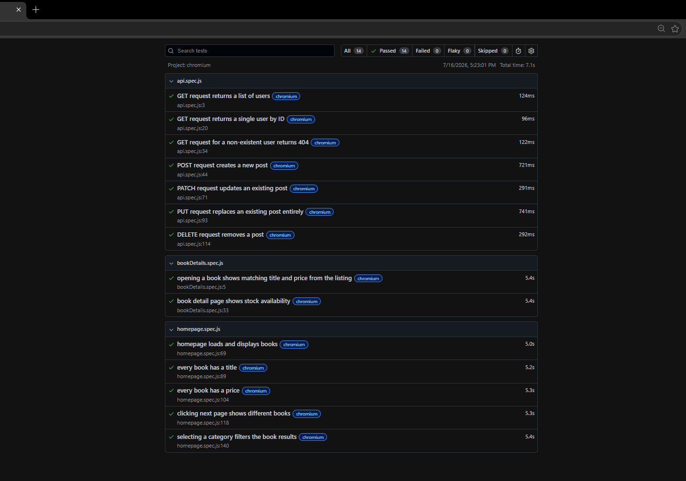

# 🎭 Playwright QA Automation Portfolio Project

A test automation project built with **Playwright (JavaScript)**, covering both **UI automation** (using the Page Object Model) and **API testing**. UI tests target the demo e-commerce site **Books to Scrape** (https://books.toscrape.com); API tests target the public practice API **JSONPlaceholder** (https://jsonplaceholder.typicode.com).

---

## 📌 Project Overview

This project demonstrates test automation across two layers of an application: the user interface and the underlying API. UI tests cover key user flows on an online bookstore — homepage functionality, pagination, category filtering, and product detail validation. API tests cover the full CRUD lifecycle (Create, Read, Update, Delete) plus a negative test case, using Playwright's built-in request context.

---

## ✨ Test Coverage

### UI Tests — Homepage
- Verify the homepage loads and displays books
- Verify every book displays a title
- Verify every book displays a price
- Verify pagination loads different books on the next page
- Verify selecting a category filters the results

### UI Tests — Book Details
- Verify the selected book's title and price match what was shown on the listing page
- Verify stock availability is displayed on the detail page

### API Tests
- Verify a GET request returns a list of users
- Verify a GET request returns a single user by ID
- Verify requesting a non-existent user returns a 404 (negative test case)
- Verify a POST request creates a new post (201 Created)
- Verify a PATCH request updates a single field on an existing post
- Verify a PUT request replaces an existing post entirely
- Verify a DELETE request removes a post

**Current Status**
- 14 automated test cases
- 3 spec files
- Covers both UI (Playwright browser automation) and API (Playwright request context) testing
- Tested and passing on Chromium (config supports Firefox and WebKit, not yet run across all three)

---

## 🛠️ Tech Stack

- **Playwright** (JavaScript) — UI automation and API testing
- **Page Object Model (POM)** — for UI test structure
- **GitHub Actions** (CI/CD)

---

## 📂 Project Structure

```text
playwright-qa-portfolio/
├── .github/
│   └── workflows/
│       └── playwright.yml
├── pages/
│   ├── HomePage.js
│   └── BookDetailsPage.js
├── tests/
│   ├── homepage.spec.js
│   ├── bookDetails.spec.js
│   └── api.spec.js
├── screenshots/
│   └── test-report.png
├── playwright.config.js
├── package.json
└── README.md
```

---

## 🏗️ Why Page Object Model?

Instead of placing selectors directly inside test files, UI page interactions are organized into reusable page object classes (`pages/`). Tests call readable methods such as:

```javascript
homePage.openCategoryByName('Travel');
```

instead of repeating raw CSS selectors across the test suite. If the site's HTML structure changes, only the page object needs updating — not every test.

---

## ▶️ Running the Tests Locally

```bash
npm install
npx playwright install
npx playwright test
```

Open the HTML report:

```bash
npx playwright show-report
```

Run only the API tests:

```bash
npx playwright test api.spec.js
```

---

## ⚙️ Continuous Integration

This project uses GitHub Actions to automatically run the full Playwright test suite on every push to `main` — [verified passing](https://github.com/mktabular/playwright-qa-portfolio/actions).

---

## 📊 Sample Test Report



---

## 💡 What I Learned

Building this project helped me strengthen my understanding of both UI and API test automation using Playwright. Along the way I learned how to:

- Build a page object structure with reusable locators and methods
- Write UI test assertions for data integrity, navigation, and filtering
- Write API tests covering the full CRUD lifecycle (GET, POST, PATCH, PUT, DELETE)
- Understand and correctly assert on HTTP status codes (200, 201, 404)
- Write negative test cases — verifying failure behaves correctly, not just the happy path
- Distinguish PATCH (partial update) from PUT (full replacement)
- Organize tests into multiple spec files by responsibility
- Configure Playwright's `baseURL`, reporters, and browser projects
- Set up and verify a GitHub Actions CI workflow

---

## 🚀 Future Improvements

- Run the full suite across Chromium, Firefox, and WebKit
- Add authentication/token-based API testing
- Add response schema validation for API tests
- Add visual regression testing for UI
- Expand UI coverage with additional scenarios (e.g. empty search results, invalid pages)

---

## 👨‍💻 About This Project

This project is part of my ongoing QA automation learning journey and portfolio development.